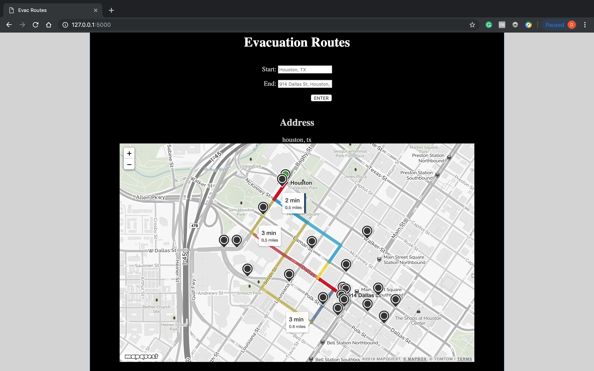

# Evacuation Routes

Optimizing Evacuation Routes using Real-Time Traffic Information

## Problem Statement

#### [New Light Technologies](https://www.newlight.com/)

> During disasters, search and rescue teams must be able to search for and get to survivors as fast as possible (in terms of travel time and distance). Current GIS and navigation systems allow responders to calculate travel time and distance between origin and destination and propose an optimal route to the destination. However, many of the current platforms do not rely on real-time data (e.g. road closures, damaged roads etc.) and can produce inaccurate or inefficient results. This project will leverage social media, news feeds and other datasets (e.g. Waze, Here.com) to identify real time road closures or damaged roads, power outages and other blocked routes that may affect traffic lights, travel time, travel safety and more.The system should allow the user (the public or rescue teams) to search for any of these conditions and identify if and where they exist in a specific location (street, neighborhood, city etc.)


## Gathering Data

#### [David Capella](http://davidcapella.com)

> I built a module that interacts with the [HereAPI](https://www.here.com/) for alternative route geolocations and already known flags in the area for each of those alternative routes. In addition, I constructed another module that interacts with the [NewsAPI](https://newsapi.org/) that will gather links according to a search query of a city. Upon gathering the links I scrapped each of those websites and kept anything that had to do with road (or other related words). Then as an added part if it had something to do with closure or danger of some sort. Finally, using the micro web framework, [Flask](http://flask.pocoo.org/), I put my team's modules intergrated together to create a web application. I also had to have Python interact with JavaScript in order for the [MapQuestAPI](https://www.mapquest.com/) to work. 

#### [Haya Toumy](https://hayatoumy.github.io/hayatoumy/)

> Tweepy library is used to grab live tweets about traffic. Beforehand, it was manually searched to determine which Twitter users post mainly about traffic and road conditions, in each city of the most flooded ones in the US. A data frame with these Twitter usernames, and the corresponding cities was created, for the user (first respondent) to select from. Next step goal: make this data frame inclusive to every city in the US; specially the ones who face natural disasters more frequently than others.

## Modeling

#### [David Capella](http://davidcapella.com)

> In my part I had no real model. I used word2vec but eventually I would like to create a model that would effortlessly decide what's relevant in order to make the speed faster and take only specific sentences that are neccessary.

#### [Haya Toumy](https://hayatoumy.github.io/hayatoumy/)

> No modeling was needed in this process. Search through collected live tweets' text to find the entered street name by user; handling for any letter case entered by user to be accepted.

## Results

#### [David Capella](http://davidcapella.com)



> In order to run our final pre-deployed project, you need to do a couple of steps:
> * Fork this git repo into your own.
> * Place it somewhere
> `git clone repo`
> * Go into it
> `cd evacuation-routes`
> * Create an enviornment
> `python -m venv venv`
> * Activate
> `souce venv/bin/activate`
> * Install requirements
> `pip install -r requirements.txt`
> * Add file KeysAPI
> `touch app/KeysAPI.py`
> * Inside app/KeysAPI.py

```
newsapi = # Your key
here_id = # Your key
here_code = # Your key

tweet_1 = # Your key
tweet_2 = # Your key
tweet_3 = # Your key
tweet_4 = # Your key
```

> * Execute it
> `python evacuation_routes.py`
> * Then go to the port it specifies; most likey will be port: http://127.0.0.1:5000

#### [Haya Toumy](https://hayatoumy.github.io/hayatoumy/)

> A function that takes a user input for a street name, and returns 20 most recent tweets about that road condition and all its intersections. The function searches through traffic tweets from Houston, TX by default, but user can choose another city from the provided ones. All done in one line, all in small letters, for the ease and quick of use.

## Built With

* Jupyter Notebook
* Python
* Flask
* JavaScript

## Authors

#### [Haya Toumy](https://hayatoumy.github.io/hayatoumy/)
#### [Christopher Hutchins](https://github.com/cfarhutchins)
#### [Xlegic SinAustin](https://www.linkedin.com/in/xlegic-howard-sin-austin-b64170163/)
#### [David Capella](http://davidcapella.com)

## Acknowledgments

* [NewsAPI](https://newsapi.org/)
* [Here API](https://developer.here.com/)
* Tweepy
* MapQuest API
